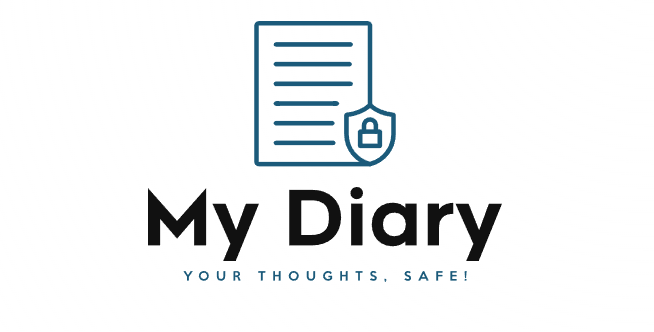
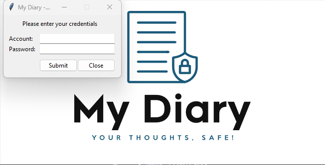
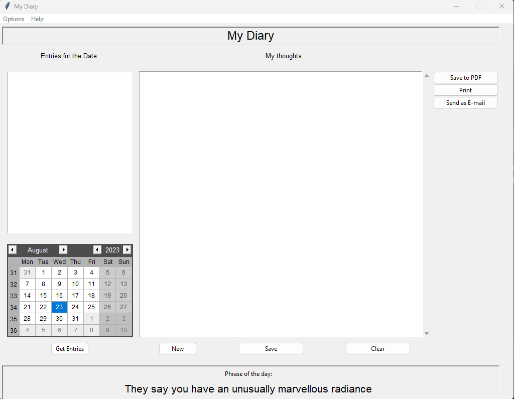

# My Diary App



The **My Diary App** is a personal diary application built in Python using the Tkinter library. The application allows users to create, edit, save, and print diary entries in text format. Additionally, the app offers security features such as user authentication and password encryption.

## Key Features

- Creation and editing of diary entries.
- Secure saving of diary entries.
- Printing of diary entries in PDF format.
- Entry protection with user authentication.
- User password change functionality.
- Automatic removal of empty entries.

## Requirements

- Python 3.x
- Libraries: Tkinter, Pillow, FPDF, re, sqlite3, os, requests, json, win32api, win32print

## Installation

1. Clone this repository to your system:
    ```
   git clone https://github.com/username/my-diary-app.git
   cd my-diary-app
    ```

2. Install the required libraries:
    ```
   pip install -r requirements.txt
    ```

## How to Use

1. Run the `project.py` file to start the application:
   ```
   python project.py
   ```

2. In the login screen, enter your credentials or create a new account.

3. In the main diary screen, you can create, edit, save, print, and manage your diary entries.

## Screenshots


*Login Screen*


*Main Diary Screen*

## Author

- Name: Pedro Caribé
- Contact: pho.caribe@gmail.com
- LinkedIn: [Pedro Caribé](https://www.linkedin.com/in/pedro-caribe/)
- GitHub: [pedrocaribe](https://github.com/pedrocaribe)

## License

This project is licensed under the MIT License. See the `LICENSE` file for more details.